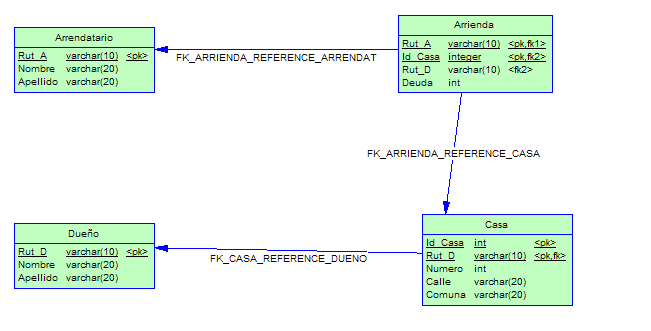

# CLASE 5

Subconsultas
------------

Una subconsulta es una consulta SQL anidada dentro de una consulta más grande. Una subconsulta puede ocurrir en:

*   Una cláusula `SELECT`
    
*   Una cláusula `FROM`
    
*   Una cláusula `WHERE`
    

La consulta interna se ejecuta primero antes que su consulta principal para que los resultados de una consulta interna se puedan pasar a la consulta externa.

    --Sintaxis 
    SELECT subconsulta.columnas
    FROM (SELECT columnas FROM tabla WHERE ...) as subconsulta
    WHERE ....
    

    --Subquerys en WHERE
    SELECT ... FROM... WHERE campo IN (Subquery)
    --Subquery en SELECT
    SELECT campo=subquery FROM .... WHERE....
    

Observación: es importante referenciar la subconsulta y sus campos con el comando `as`, ya que al requerirla después en el `SELECT` de afuera debemos llamarla por sus nombres.

Consultas de Cruce
------------------

### INNER JOIN

Esta expresión selecciona registros que tienen valores coincidentes en ambas tablas.

    SELECT columna(s)
    FROM tabla1
    INNER JOIN tabla2
    ON tabla1.columna_pivote = tabla2.columna_pivote;
    

### LEFT JOIN

Devuelve todos los registros de la tabla izquierda (tabla1) y los registros coincidentes de la tabla derecha (tabla2). El resultado es 0 registros del lado derecho, si no hay coincidencia.

    SELECT columna(s)
    FROM tabla1
    LEFT JOIN tabla2
    ON tabla1.columna_pivote= tabla2.columna_pivote;
    

### RIGHT JOIN

Devuelve todos los registros de la tabla derecha (tabla2) y los registros coincidentes de la tabla izquierda (tabla1). El resultado es 0 registros del lado izquierdo, si no hay coincidencia.

    SELECT columna(s)
    FROM tabla1
    RIGHT JOIN tabla2
    ON tabla1.columna_pivote = tabla2.columna_pivote;
    

### FULL JOIN

Devuelve todos los registros cuando hay una coincidencia en los registros de la tabla izquierda (tabla1) o derecha (tabla2).

    SELECT columna(s)
    FROM tabla1
    FULL JOIN tabla2
    ON tabla1.columna_pivote = tabla2.columna_pivote
    WHERE condicion
    

Unión de querys
---------------

Con el comando **UNION ALL** puedo unir el resultado de una o varias consultas a mismos campos. Observación: los campos se unen incluso si están duplicados.

    SELECT columna(s) FROM tabla1 
    UNION ALL 
    SELECT columna(s) FROM tabla2;
    

Manos a la obra: Ejercicio # 1
------------------------------

"Arriendo Seguro S.A" es una de las asociaciones encargadas de administrar el proceso de arrendar casas en Santiago. Para evitar las molestias de cobranzas para los propietarios ellos se encargan del cobro, por lo cual han diseñado el siguiente modelo de datos, con el fin de obtener toda la información necesaria y llevar el control del proceso.

1.  Cree las tablas e ingrese datos acordes a cada una de ellas (ver anexos)
    
2.  Qué Casas están en la comuna de Macul
    
3.  Muestre cantidad adeudada por cada arrendatario
    
4.  Muestre a los arrendatarios con deuda mayor a 100000
    
5.  Cantidad de casas por comunas
    
6.  Deudas por dueño
    
7.  Ordenar 6) por deuda de mayor a menor
    

**Modelo ERD**

**Tabla Arrendatario:**  

    
    
    INSERT INTO arrendatario
    VALUES ('11246890-4','Emilio','Gaete')
    INSERT INTO arrendatario
    VALUES ('9654789-k','Sulema','Garrido')
    INSERT INTO arrendatario
    VALUES ('5345678-8','Marcos','Urrutia')
    INSERT INTO arrendatario
    VALUES ('5432345-6','Tamara','Romero')
    INSERT INTO arrendatario
    VALUES ('1243235-8','Liliana','Sotela')
    INSERT INTO arrendatario
    VALUES ('6789765-0','Francisco','Rodriguez')
    INSERT INTO arrendatario
    VALUES ('7987657-9','Carla','Matus')
    INSERT INTO arrendatario
    VALUES ('12349840-4','Melissa','Torres')
    
    Select * FROM Arrendatario
    
    

**Tabla Arrienda:**  

    
    
    INSERT INTO arrienda
    VALUES ('11246890-4','1', 20000 ,'13678567-9')
    INSERT INTO arrienda
    VALUES ('9654789-k','2', 34000 ,'12567298-5')
    INSERT INTO arrienda
    VALUES ('5345678-8','3',123000, '11876984-2')
    INSERT INTO arrienda
    VALUES ('5432345-6','4',0,'8765432-1')
    INSERT INTO arrienda
    VALUES ('1243235-8','5',320000,'8647299-k')
    INSERT INTO arrienda
    VALUES ('6789765-0','6',87000,'10234567-5')
    INSERT INTO arrienda
    VALUES ('7987657-9','7',0,'6783456-7')
    INSERT INTO arrienda
    VALUES ('12349840-4','8',100000,'7890987-3')
    INSERT INTO arrienda
    VALUES ('11246890-4','9',145000,'13678567-9')
    INSERT INTO arrienda
    VALUES ('9654789-k','10',67000,'12567298-5')
    INSERT INTO arrienda
    VALUES ('9654789-k','11',0,'8765432-1')
    INSERT INTO arrienda
    VALUES ('1243235-8','12',187000,'8647299-k')
    
    
    SELECT * FROM arrienda
    
    
    

**Tabla Casa:**  

    
    INSERT INTO casa
    VALUES (1,'13678567-9','2243','Las Torres', 'Macul')
    INSERT INTO casa
    VALUES (2,'12567298-5','123','Guillermo Mann', 'Nunoa')
    INSERT INTO casa
    VALUES (3,'11876984-2','5467','P.de Valdivia', 'Nunoa')
    INSERT INTO casa
    VALUES (4,'8765432-1','7485', 'Los Olmos', 'Macul')
    INSERT INTO casa
    VALUES (5,'8647299-k','0876', 'Los Platanos', 'Quilicura')
    INSERT INTO casa
    VALUES (6,'10234567-5','5546', 'Los Espinos', 'San Ramon')
    INSERT INTO casa
    VALUES (7,'6783456-7','6657', 'Zañartu', 'Recoleta')
    INSERT INTO casa
    VALUES (8,'7890987-3','4059', 'Los Alerces', 'Maipu')
    INSERT INTO casa
    VALUES (9,'13678567-9','0987','Av.Grecia', 'Macul' )
    INSERT INTO casa
    VALUES (10,'12567298-5','7657','Los Trucados', 'Nunoa')
    INSERT INTO casa
    VALUES (11,'8765432-1','778', 'Almirante la Torre', 'Maipu')
    INSERT INTO casa
    VALUES (12,'8647299-k','7854', 'Irarrazaval', 'Nunoa')
    INSERT INTO casa
    VALUES (13,'6783456-7','4444', 'Marathon', 'Peñaflor')
    INSERT INTO casa
    VALUES (14,'7890987-3','3335', 'Manuel de Salas', 'Santiago')
    
    SELECT * FROM casa
    
    

**Tabla Dueño:**  

    
    INSERT INTO dueno
    VALUES ('13678567-9','Carlos','Gutty')
    INSERT INTO dueno
    VALUES ('12567298-5','Cristian','fuentes')
    INSERT INTO dueno
    VALUES ('11876984-2','Maria','Mercedes')
    INSERT INTO dueno
    VALUES ('8765432-1','Gloria','Sura')
    INSERT INTO dueno
    VALUES ('8647299-k','Patricio','Rojas')
    INSERT INTO dueno
    VALUES ('10234567-5','Leonardo','Opazo')
    INSERT INTO dueno
    VALUES ('6783456-7','Silvia','Hernandez')
    INSERT INTO dueno
    VALUES ('7890987-3','Eduardo','Lizama')
    
    SELECT * FROM dueno
    
    

### Observaciones

Comentar que al montar el esquema se debe hacer en **orden de dependencias** (de menor a mayor); por ejemplo la tabla `casa` depende de 1 tabla (ver diagrama ERD), mientras que `arrienda` depende de 2 tablas, y `arrendatario/dueno` dependen de 0 tablas. De esta manera, se crean `arrendatario/dueno` primero, luego `casa` y finalmente `arrienda`:

    -- El orden SI IMPORTA!
    
    CREATE TABLE Arrendatario (Rut_A varchar(10) PRIMARY KEY, 
    Nombre varchar(20), 
    Apellido varchar(20))
    
    CREATE TABLE dueno (Rut_D varchar(10) PRIMARY KEY, 
    Nombre varchar(20), 
    Apellido varchar(20))
    
    CREATE TABLE casa (Id_Casa int PRIMARY KEY, 
    Rut_D varchar(10) REFERENCES dueno(RUT_D), 
    Numero int, 
    Calle varchar(20), 
    Comuna varchar(20))
    
    CREATE TABLE Arrienda (Rut_A varchar(10) REFERENCES Arrendatario(Rut_A), 
    Id_Casa int REFERENCES casa(Id_Casa), 
    Deuda int, 
    Rut_D varchar(10) REFERENCES dueno(Rut_D))
    

La ingesta de datos debe hacerse en el mismo orden.
